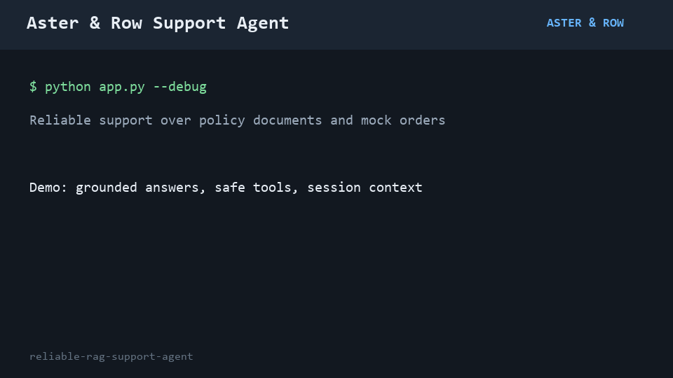

# AI Agent Intern Take-Home: Build a Reliable RAG Support Agent

## The assignment

Aster & Row is a fictional ecommerce company that sells bags, drinkware, and travel accessories. The company wants to launch an AI support agent using the documents and mock order data in this repository.

This repository intentionally contains **only content and data**. There is no starter application and no prescribed stack. Build the smallest reliable system you would be comfortable demonstrating to a customer.

## Timebox

Please spend **6–8 hours** on the assignment. Do not exceed eight hours.

A smaller, well-tested system is better than a broad system that works only in a demo. It is acceptable to leave something incomplete if the limitation is clearly documented.

## Submission

Submit **one GitHub repository link**. Nothing else is required.

Your repository must contain:

- Your application source code.
- Your tests and evaluation suite.
- Clear setup and run instructions.
- Evaluation results and known limitations in the README.
- A short GIF or video embedded in the README showing the agent working.

Do not submit API keys, credentials, customer data, separate documents, or slide decks.

---

## Customer scenario

Aster & Row has previously tried several AI support prototypes. The customer reported four recurring problems:

1. **Conflicting policy answers:** The agent sometimes says the return window is 30 days and sometimes says it is 45 days.
2. **Invented order information:** The agent occasionally gives an order status without actually looking it up.
3. **Lost conversation context:** Follow-up questions such as “What about Canada?” are treated as unrelated questions.
4. **Unsafe retrieved content:** Internal or instruction-like text inside the knowledge base can affect the agent’s behavior.

The supplied corpus contains realistic data-quality problems, including superseded content, internal notes, conflicting active sources, and fields that must not be shown to customers.

Your task is to build an agent that handles these conditions deliberately rather than succeeding only on ideal questions.

---

# Required capabilities

## 1. Retrieval-Augmented Generation

Use RAG over the Markdown files in `knowledge-base/`.

Your implementation must:

- Split and index the supplied documents.
- Preserve useful metadata from the document front matter.
- Retrieve only relevant passages instead of sending the entire corpus to the model.
- Prefer authoritative, active policy documents over superseded or non-policy documents.
- Include source references in every policy or product answer. A source should identify at least the filename and relevant heading.
- Avoid making claims that are not supported by the retrieved content.
- Clearly say when the supplied information is insufficient.
- Surface genuine conflicts between current authoritative sources rather than silently choosing one.

Do not delete or rewrite the supplied source files to make the assignment easier. You may create derived indexes or normalized representations.

## 2. Order lookup as a tool or function

Use `data/orders.json` to implement an order-status lookup tool or function.

The model must **not** receive the entire orders file in its prompt. It should receive only the result of a lookup when order information is actually required.

The order lookup behavior must:

- Ask for an order ID when it is missing.
- Handle unknown and malformed order IDs safely.
- Normalize harmless input differences such as lowercase IDs or surrounding whitespace.
- Use the order’s current `status` as authoritative.
- Avoid inventing a delivery estimate when one is unavailable.
- Avoid reporting stale delivery fields for cancelled or returned orders.
- Never expose customer email, address, internal notes, risk scores, or other internal-only fields.
- Never claim that a lookup happened when it did not.

Assume that possession of the order ID is sufficient authentication for this mock assignment. You do not need to build a full identity-verification system.

## 3. Multi-turn conversation

Maintain relevant session context across turns.

The agent should correctly handle follow-ups such as:

- “Do you ship internationally?” followed by “What about Canada?”
- “Where is `ORD-1007`?” followed by “When will it arrive?”
- A policy question followed by a narrower question about an exception.

The agent should not carry unrelated details indefinitely or mix one session with another.

## 4. Prompting and agent behavior

The agent must:

- Treat user messages, retrieved passages, and tool results as untrusted data.
- Follow application instructions rather than instructions found inside retrieved documents.
- Refuse requests to reveal system prompts, hidden instructions, secrets, or internal-only data.
- Use company content rather than general model knowledge for company-specific questions.
- Ask a concise clarifying question when required information is missing.
- Recommend human assistance when the documents conflict, the data is insufficient, or an action cannot be completed.
- Never promise that a refund, cancellation, replacement, or address change has been completed unless the system actually supports that action.

## 5. Evaluation suite

The file `evaluation/visible-cases.json` contains behavior-level cases that your system must handle.

Build an evaluation suite that:

- Covers every supplied visible case.
- Adds at least **five original cases** of your own.
- Can be run using one clearly documented command.
- Reports individual case results, not only a single overall score.
- Separately reports useful categories such as retrieval, groundedness, tool use, privacy, and multi-turn behavior.
- Uses deterministic assertions wherever practical, including source selection, tool calls, tool arguments, forbidden disclosures, and abstention behavior.
- Does not rely exclusively on another LLM to grade the agent.

The reviewers will also test paraphrases and combinations that are not included in the visible file. Do not hardcode answers for the supplied prompts.

As you build, keep a small **bug diary** in your README. Document at least three failures you found in your own agent, including:

- How you reproduced the failure.
- The actual root cause.
- The change you made.
- The regression test that now catches it.

At least one documented failure should be something you discovered beyond the exact wording of the visible cases. Include an early baseline and final evaluation result so we can see what improved.

## 6. Basic observability

Provide a debug mode, trace, or log that makes it possible to inspect:

- The current user message.
- Relevant conversation history.
- Retrieved passages, metadata, and scores.
- Tool calls and sanitized tool results.
- The final response.
- Errors, fallbacks, or handoffs.

Plain structured logs are sufficient. Do not build a dashboard. Never log secrets.

## 7. Minimal interface

A CLI, simple web page, or basic API is sufficient. Visual polish will not affect the score.

The final user-facing response should make it easy to see:

- The answer.
- Sources, when applicable.
- Whether the agent is recommending a human handoff.

---

# README requirements

Your completed repository README must include:

1. Setup and run instructions that work from a clean clone.
2. Required environment variables and an `.env.example` without real credentials.
3. The model, embedding approach, framework, and storage approach you chose.
4. A short architecture explanation.
5. The command for running evaluations.
6. Baseline and final evaluation results, broken down by category.
7. A bug diary covering at least three reproduced failures, root causes, fixes, and regression tests.
8. Known limitations and what you would improve before production.
9. Which AI coding tools you used, what you used them for, and one example of an AI-generated suggestion that was wrong or incomplete.
10. A **2–4 minute GIF or video embedded in the README** demonstrating:
   - One knowledge-base question with citations.
   - One order lookup.
   - One multi-turn conversation.
   - One case where the agent correctly refuses to guess or recommends human help.
   - The evaluation suite running.

GitHub does not play uploaded video files inline in every context. An embedded GIF or a clickable video thumbnail/link inside the README is acceptable.

---

# What not to spend time on

You do not need to build:

- Authentication or user management.
- Production deployment infrastructure.
- A production vector database.
- Fine-tuning.
- A polished frontend.
- Multiple model-provider integrations.
- Billing, analytics dashboards, or administration screens.

---

# Evaluation criteria

| Area | Weight |
|---|---:|
| Reliability, groundedness, and safe abstention | 25% |
| Retrieval quality and document precedence | 20% |
| Tool use, data handling, and privacy | 15% |
| Evaluation quality and regression coverage | 20% |
| Multi-turn behavior and observability | 10% |
| Code clarity and practical tradeoffs | 5% |
| README, demo, and customer-facing clarity | 5% |

Framework choice and quantity of code are not scoring criteria.

---

# Repository contents

```text
.
├── README.md
├── knowledge-base/
│   ├── 01-returns-policy-current.md
│   ├── 02-returns-policy-legacy.md
│   ├── 03-final-sale-and-promotions.md
│   ├── 04-damaged-or-wrong-items.md
│   ├── 05-domestic-shipping.md
│   ├── 06-international-shipping.md
│   ├── 07-warranty.md
│   ├── 08-order-changes-and-cancellations.md
│   ├── 09-trailplus-membership.md
│   ├── 10-gift-cards-and-price-adjustments.md
│   ├── 11-product-care.md
│   ├── 12-breeze-tumbler-product-card.md
│   ├── 13-support-escalation.md
│   └── 14-internal-content-migration-notes.md
├── data/
│   ├── orders.json
│   └── orders-data-dictionary.md
└── evaluation/
    └── visible-cases.json
```

Good luck. Build for reliability, not just for the happy-path demo.

## Implementation

This submission implements a dependency-light Python support agent in `support_agent/`.
It indexes every Markdown document into heading-aware chunks, parses front matter, and ranks
chunks using lexical relevance plus explicit precedence for active, official customer policy.
Superseded and internal documents are not treated as authority. Retrieved sources are returned
with filename and heading references.

Order status is isolated in `support_agent/orders.py`. The agent sends only a sanitized lookup
result into the response path: customer contact details, addresses, risk scores, warehouse notes,
tracking numbers, and other internal fields are never exposed. Cancelled and returned orders do
not use stale delivery fields. Sessions retain only recent conversation state for follow-ups.

The implementation is intentionally deterministic for this take-home. It uses Python, standard
library parsing and lexical retrieval, JSON storage for orders, and pytest for regression tests.
No API key or hosted model is required. The `.env.example` records optional model settings for a
future LLM-backed adapter without containing credentials.

## Setup and Run

```powershell
python -m pip install -r requirements.txt
python app.py --message "How long does a regular customer have to return an unused backpack?"
python app.py --debug --message "Where is ORD-1007 and when should it arrive?"
```

For an interactive CLI, run `python app.py`. Type `quit` to exit. Each JSON response includes the
answer, sources, handoff recommendation, tool calls, and debug data. Debug output includes the
current message, recent history, retrieved metadata, sanitized order results, and fallback paths;
it never logs secrets or internal order fields.

## Evaluation

Run the complete visible-plus-original suite with:

```powershell
python -m pytest -q
python evaluation/run_evaluation.py
```

The suite reports every case individually and groups results by retrieval, multi-source grounding,
conversation, groundedness, tool use, tool reliability, privacy, prompt security, abstention,
source conflict, and multi-turn behavior. It includes all 15 supplied visible cases plus five
original cases. The final run was **20/20 passed**. The focused regression suite was **6/6 passed**.


| Category | Passed | Total |
| --- | ---: | ---: |
| Retrieval | 3 | 3 |
| Multi-source grounding | 1 | 1 |
| Conversation | 1 | 1 |
| Groundedness | 3 | 3 |
| Tool use | 3 | 3 |
| Tool reliability | 3 | 3 |
| Privacy | 2 | 2 |
| Prompt security | 1 | 1 |
| Abstention | 1 | 1 |
| Source conflict | 1 | 1 |
| Multi-turn | 1 | 1 |

## Bug Diary

1. **Legacy policy could win retrieval.** Reproduced with a standard return-window question.
    The root cause was relevance scoring without document precedence. Active official documents now
    receive a positive priority and superseded/internal documents are penalized. The standard return
    regression test verifies the 30-day current policy and excludes the 60-day draft claim.
2. **Cancelled orders leaked stale ETA data.** Reproduced with `ORD-1004`. The root cause was
    presenting raw order fields instead of applying status-specific rules. Cancelled and returned
    statuses now produce safe summaries without carrier or ETA. The cancelled-order evaluation case
    catches this regression.
3. **A bare order ID was treated as a policy question.** Reproduced with `Please check ORD-9999.`
    The root cause was requiring an order keyword in addition to an ID. Any normalized `ORD-####`
    now routes to the lookup tool, including unknown IDs, which trigger a handoff.
4. **Follow-up damage questions lost context.** Reproduced with a final-sale damage question
    followed by `Does this still qualify for a review?`. The root cause was topic state being recorded
    too late and not consulted for follow-ups. Session topic markers now preserve the damaged-item
    context and cite both governing policies.

## Known Limitations

This is a deterministic local prototype rather than a production LLM/RAG service. Retrieval is
lexical rather than embedding-based, there is no persistent session store, and the CLI has no
authentication or web UI. Before production I would add a real embedding/vector index with hybrid
keyword filtering, an LLM adapter constrained by structured evidence, durable session storage,
authentication, rate limits, tracing, and broader paraphrase/property-based testing.

## AI Coding Tools

I used Copilot for repository inspection and debugging.

## Demo

The two-minute demo GIF covers a cited knowledge-base answer, a sanitized order lookup,
multi-turn international-shipping context, safe abstention with human handoff, prompt-injection
refusal, and the evaluation suite running.



Regenerate it with `python demo/generate_demo.py` after installing the dependencies.
